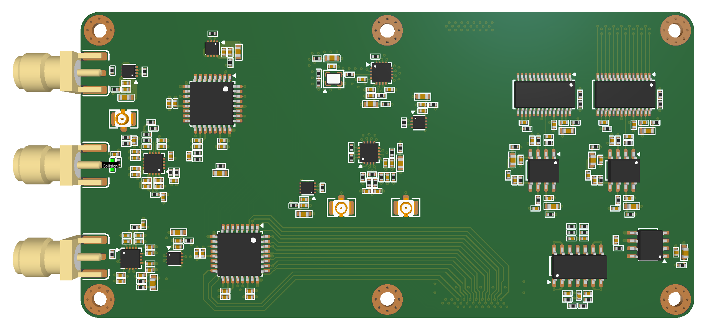

# Sampler_ver.0.0

Sampler module, based on ADCMP582 comparator and SY89296 programmable delay line, with AXT460324 P4S series Board-to-Board connector. Contain TDR pulse circuitry with adjastable delay, clock distribution and power management circuitry.
To last update time, development were stoped because of ICs purchase impossibility. It will be resume, when the ICs become available.

    

Board Top View

